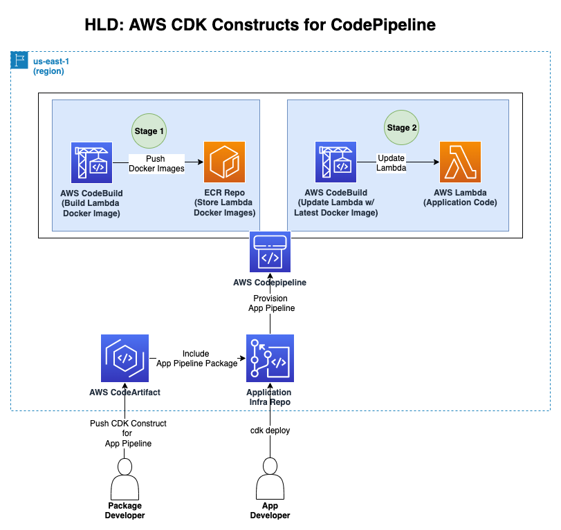
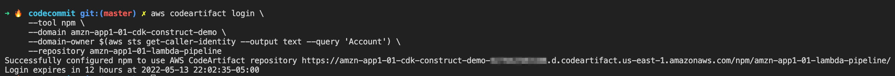
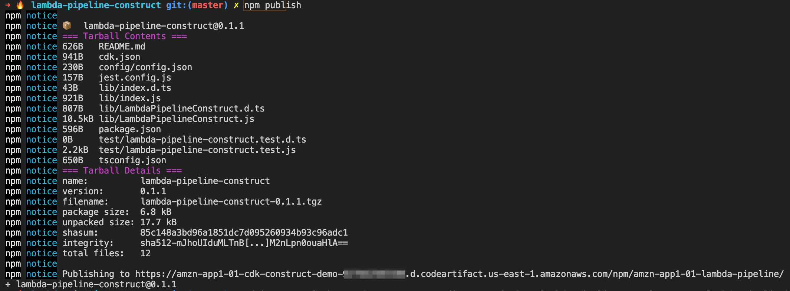
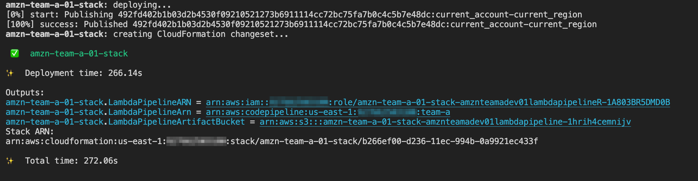

# CDK Constructs for Lambda Pipeline

This demonstration is to show how we can start using CDK Constructs and enhance the producticty and share our published constructs to other team members for the benefit of DevOps Principles.

# Implementation

## HLD



Here, the reader is playing two roles (*Package Developer and Application Developer*) in order to undestand how to implement this solution.

## Role 1: Shared-Services Developer

Role of the shared services developer is to develop services which are common across the originazation like CodeArtifact etc. that can be consumed by other teams.

## Role 2: Package Developer

Role of the package developer is to develop a CDK Construct, in our case its going to be a re-usable construct for building a Codepipeline for lambda function that has following functionalities:

## Stage 1

1. Builds the docker file
2. Push the docker file to ECR (Container Registry)

## Stage 2

1. Pull the docker file from ECR
2. Update Lambda function with the latest docker image.

Once the consctruct is ready for publishing, Pacakge Developer is going to publish this `lambda-pipeline-construct` as a `npm` package to AWS CodeArtifact (Its a artifact repository, just like Artifactory, nexus or jfrog)

## Role 3: Application Developer

Role of the Application Developer is to include that `lambda-pipeline-construct` in `package.json` file and feed project specific variables like coderepo, branch, etc and does cdk deploy, thats it!!, Application developer would be seeing a Codepipeline specific for his lambda application.

## Pre-requisites

1. Install Nodejs
2. Install Docker
3. Install VS Code (Optional)
4. Install AWS CDK (latest version)
5. Install AWS CLI
6. Configure AWS CLI with AWS Account (do `aws sts get-caller-identity` for validation)


## Provision Infrastructure - Shared Services Developer Role(Build CodeArtifact) 

1. `cd prerequisites/codeartifact`
2. Create CodeArtifact Repo, when you want to publish this `lambda-pipeline-construct` package
   1. (Optional) make necessary changes to `config/config.json` file
   2. run `npm install`
   3. run  `cdk synth` review template file from `cdk.out` folder.
   4. run `cdk deploy`
   5. you should be seeing an output something like this: 
    ```CodeArtifactResources: creating CloudFormation changeset...
    ✅  CodeArtifactResources
    ✨  Deployment time: 57.14s
    Outputs:
    CodeArtifactResources.amznapp101coderartifactdomainname = amzn-app1-01-cdk-construct-demo
    CodeArtifactResources.amznapp101coderartifactreponame = amzn-app1-01-lambda-pipeline
    Stack ARN:
    arn:aws:cloudformation:us-east-1::stack/CodeArtifactResources/297bfb30-4410-11ed-bd03-0ec07ab1c2b3
    ```
    take note of `repo-name` and `domain-name`
   6. If you are seeing error related to `bootstrap`, run this `cdk bootstrap` command and re-try `cdk deploy`

## Provision Infrastructure - Package Developer Role(Build Construct)

1. `cd ../../package-developer/lambda-pipeline-construct/`
2. Replace Appropriate domain and repository in the following command and run it in `terminal`  
     ```
     aws codeartifact login \
        --tool npm \
        --domain <replace-with-domain-name> \
        --domain-owner $(aws sts get-caller-identity --output text --query 'Account') \
        --repository <replace-with-repo-name>
    ```
3. You should be seeing an output simillar to this:
 
4. run `npm install`
5. Build a npm pacakges by `npm run build`
6. Publish construct with the following command `npm publish`
7. You should be seeing an output simillar to this:
 
8. *Congratulations !! you made it!!*
9. Now you can validate it by going to **AWS Console** in CodeArtifact service.

Note: If you run into this error 
```npm ERR! code E401
npm ERR! Unable to authenticate, your authentication token seems to be invalid.
npm ERR! To correct this please trying logging in again with:
```
then delete package-lock.json file

## Provision Infrastructure - Application Developer Role(Reuse-Construct)

1. `cd ../../application-developer/team-a-lambda-pipeline/`
2. Open `package.json` review `dependencies` section `"lambda-pipeline-construct": "1.0.0"` if it doesnt exist please refer to `Provision Infrastructure - Package Developer` steps and update the package name.
3. run `npm install`
4. run  `cdk synth` review template file from `cdk.out` folder.
5. run `cdk deploy`
6. you should be able to see the output simillar to this:
    
7. Congratulations !! you made it !!.
8. Now go to Codepipeline from AWS Console and you should be seeing a pipeline that has been created.
9. Now, if you want to create a new pipeline for new team, all you need to do is copy `team-a-lambda-pipeline` folder and make necessary changes in `config/config.json` file and run `npm install` and `cdk deploy`. Thats it!!

Note: If you run into this error 
```npm ERR! code E401
npm ERR! Unable to authenticate, your authentication token seems to be invalid.
npm ERR! To correct this please trying logging in again with:
```
then delete package-lock.json file

Finally, dont forget to delete the resources by `cdk destroy` command from terminal.

Reference urls:

[<https://aws.amazon.com/about-aws/whats-new/2022/04/aws-lambda-function-urls-built-in-https-endpoints/>](https://docs.aws.amazon.com/cdk/api/v2/docs/constructs-readme.html)

[<https://aws.amazon.com/blogs/aws/announcing-aws-lambda-function-urls-built-in-https-endpoints-for-single-function-microservices/>](https://aws.amazon.com/blogs/devops/developing-application-patterns-cdk/)

<https://docs.aws.amazon.com/cdk/api/v2/docs/aws-cdk-lib.aws_lambda-readme.html#function-url>

<https://docs.aws.amazon.com/cdk/v2/guide/getting_started.html#getting_started_install>

<https://docs.aws.amazon.com/cli/latest/userguide/getting-started-install.html>


## Security

See [CONTRIBUTING](CONTRIBUTING.md#security-issue-notifications) for more information.

## License

This library is licensed under the MIT-0 License. See the LICENSE file.

